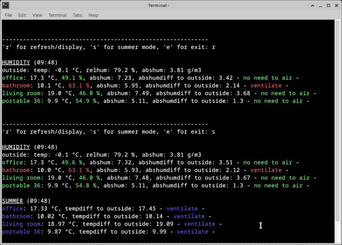

# Simple terminal-based airing app

Application that checks and displays if airing is needed (based on humidity and temperature). 
It provides a quick overview to easily compare humidity inside and outside, so that the user knows whether to ventilate or not. 

With:
- terminal output coloured accordingly to the airing suggestion for a quick overview
- optional summer mode to check whether it's cooler inside or outside to help cool down the rooms by airing
- threshold for relative humidity colouring to show if a room is too humid (e.g. > 60% relative humidity)
- minimum difference for airing suggestion (e.g. only suggest airing when the difference is grater than 10%) 

The sensors are self-build and programmed by a friend.

## Used hardware and software:
Raspberry Pi 4 with Debian GNU/Linux 11 (bullseye) 
4.3" touchscreen (DSI) 
Python version 3.11 
module sty for colouring the output

## How to use it
The app runs in the terminal (or in an IDE). It's used by typing one of the letters mentioned by the program and then pressing enter. 
The relative humidity of the rooms are coloured green (ok) or red (too humid) according to the threshold (e.g. 60%). 
The airing suggestions are: green (no need to air), red (should be aired) and orange (if it's more humid outside). 
For the summer mode, blue shows that rooms can/should be aired to cool down, orange marks that it's already cooler inside.
The thresholds and colours can be personalized by changing the code. 

For use on the Raspberry Pi with touch display, I installed the keyboard "onboard" that pops up every time the cursor is set in a window where you can type (e.g. notepad, terminal, ...) 
(More info here: https://www.industrialshields.com/blog/raspberry-pi-for-industry-26/touch-screen-configuration-kiosk-mode-virtual-keyboard-setup-249 ) 

With the help of a shell script and a desktop file, the program can be started directly by double-clicking on a desktop icon. 

Please consider:
- a sensor outside is mandatory for the app to work!
- ensure that the IP-addresses (of the sensors and the computer/Raspberry Pi) are assigned permanently in the network

## What worked for me: 
- create a **virtual environment**: 
open the terminal and type: 
\$ python3 -m venv path/to/venv (e.g. python3 -m venv /home/ynodd/airingapp) 
- install the **sty module** in the virtual environment by typing in the terminal:  
\$ pathtovenv/bin/pip install package_name (e.g. /home/ynodd/airingapp/bin/pip install sty) 
- make a **shell script** to start the python program (this is a text file which ends on .sh and which contains the code that normally would be typed in the terminal): 
it contains the headline for the shell script, activates the venv by typing (source path_to_your_venv/bin/activate) and runs the program (python3 path_to_your_venv/name_of_your_program.py) 
for example in my case, the shell script contains: 
\#! /usr/bin/bash 
source /home/ynodd/airingapp/bin/activate 
cd /home/ynodd/airingapp 
python3 main.py 
- make a **desktop** shortcut to be able to run the airing code with **double-click** on the desktop **icon**: 
create a text file ending on .desktop and save it to the Desktop. It should contain something like this: 
[Desktop Entry] 
Name=Airing App 
\#Comment= 
Exec=/home/ynodd/airingapp/airing_shortcut.desktop 
\#Icon=/usr/share/test.png 
Terminal=true 
Type=Application 

(Take care that the .desktop and .sh file have the right **permissions** to run.)

